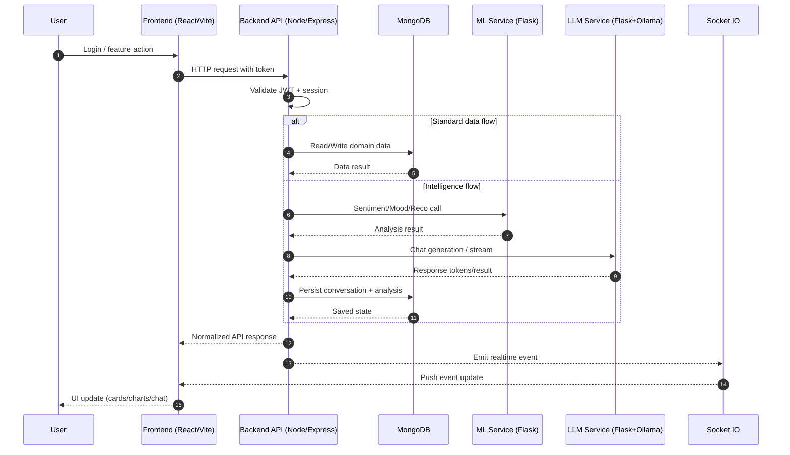
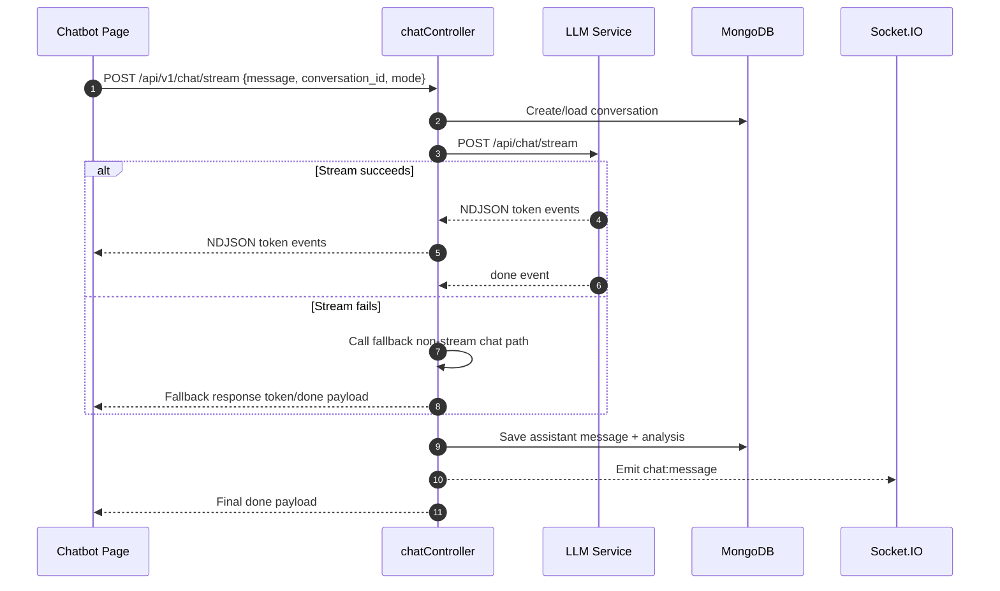

# Complete Project Explanation

This project is a full-stack mental wellness platform built with 4 core layers:

1. Frontend web app for user interaction
2. Backend API gateway for auth, business logic, persistence, and orchestration
3. ML service for mood/sentiment/emotion/recommendation intelligence
4. LLM service for therapeutic conversational responses

Main app entry and route structure are in `project/src/App.jsx`.

## 1) Frontend: What It Does, Where It Is, Why It Exists

### Core Frontend Stack

- React + Vite SPA
- Route-level lazy loading
- Context-based global state (user, theme, audio)

### Key Files

- App routing and protected/auth flow: `project/src/App.jsx`
- User session state and bootstrap: `project/src/contexts/UserContext.jsx`
- Theme persistence and dark/light behavior: `project/src/contexts/ThemeContext.jsx`
- Audio playback pipeline for nature sounds: `project/src/contexts/AudioContext.jsx`
- API client layer: `project/src/services/api.js`

### Feature Pages (what/where/why)

- Landing and onboarding to personalize mental-health experience before daily use: `project/src/pages/Landing.jsx`, `project/src/pages/Onboarding.jsx`
- Home dashboard for summary and entry-point navigation: `project/src/pages/Home.jsx`
- Mood check-in and journal for structured emotional self-reporting: `project/src/pages/MoodCheckin.jsx`, `project/src/pages/Journal.jsx`
- Recommendations (books/music/activities) for actionable coping support: `project/src/pages/Recommendations.jsx`
- Chatbot for real-time therapeutic conversation: `project/src/pages/Chatbot.jsx`
- Voice emotion and face emotion surfaces for multimodal affect capture: `project/src/pages/VoiceEmotion.jsx`, `project/src/components/FaceEmotionDetector.jsx`
- Habit and positivity engagement modules: `project/src/pages/Challenges.jsx`, `project/src/pages/Activities.jsx`, `project/src/pages/PositivityDrops.jsx`, `project/src/pages/ReflectionWall.jsx`, `project/src/pages/FutureLetters.jsx`, `project/src/pages/NatureSounds.jsx`

### Why This Frontend Design Works

- It separates emotional capture (mood/journal/voice/face), emotional support (chat), and emotional regulation tools (activities/music/challenges).
- It stores enough client state to feel responsive while deferring source-of-truth to backend APIs.

## 2) Backend: What It Does, Where It Is, Why It Exists

### Backend Role

- Secure API boundary
- JWT/session auth
- Domain orchestration
- Persistence in MongoDB
- Proxy compatibility with ML APIs
- Realtime event push via Socket.IO

### Main Backend Assembly

- Express app and route mounts: `backend/src/app.js`

### Important API Domains

- Auth and account lifecycle
- Chat and streaming conversation persistence
- Wellness/journal/mood-related operations
- Preferences/challenges/positivity/recommendations
- Emotion detection ingestion and storage
- Proxy bridge for legacy ML contracts

### Key Controllers

- Chat orchestration and stream fallback: `backend/src/controllers/chatController.js`
- Emotion analysis handling (voice/face uploads, normalization, persistence): `backend/src/controllers/emotionController.js`
- User profile and preference operations: `backend/src/controllers/userController.js`
- Challenges and progress: `backend/src/controllers/challengesController.js`
- Onboarding-style user preference data: `backend/src/controllers/preferencesController.js`

### Data Models (MongoDB/Mongoose)

- Identity and credentials: `backend/src/models/User.js`
- Token/session revocation tracking: `backend/src/models/Session.js`
- Journal content and sentiment attachment: `backend/src/models/JournalEntry.js`
- Conversation history and assistant messages: `backend/src/models/Conversation.js`
- Analysis artifacts (sentiment/emotion/risk/meta): `backend/src/models/AnalysisResult.js`
- Voice/face emotion event history: `backend/src/models/EmotionAnalysis.js`
- Recommendation catalog and feedback loops: `backend/src/models/RecommendationCatalog.js`, `backend/src/models/RecommendationFeedback.js`

### Why This Backend Design Works

- It centralizes safety, auth, and consistency instead of trusting frontend logic.
- It decouples ML/LLM implementation details from UI contracts.
- It allows progressive migration via proxy routes without breaking frontend contracts: `backend/src/routes/proxyRoutes.js`.

## 3) ML Service: Mechanisms and Model Explanations

ML service is not one single model. It is a bundle of specialized analyzers and engines.

### Core ML App

- Flask entry and endpoint registration: `ml_service/app.py`
- Mood trend logic: `ml_service/app/mood.py`
- Recommendation engine API: `ml_service/app/recommendations.py`
- Advanced sentiment routes: `ml_service/app/sentiment_advanced.py`
- Unified sentiment service internals: `ml_service/services/sentiment_service.py`

### Sentiment Models Used

1. **VADER**
   - Rule-based lexical sentiment
   - Very fast and good for real-time chat/mood check-ins
   - Produces compound score and quick polarity

2. **Classical ML**
   - TF-IDF + Logistic Regression
   - Better for structured text classification when trained artifacts exist

3. **BiLSTM**
   - Sequence-aware deep model
   - Better contextual understanding for richer journal-like text

4. **Ensemble**
   - Weighted vote across available models
   - Uses weighted confidence aggregation and label vote fusion

### Ensemble Mechanism (plain math)

$$
\hat{y} = \arg\max_{c} \sum_{m \in M} w_m \cdot \mathbf{1}(y_m = c)
$$

$$
\text{confidence}_{\text{final}} = \sum_{m \in M} w_m \cdot \text{confidence}_m
$$

Where $w_m$ are normalized model weights.

### Mood Trend Mechanism

- Stores time-stamped mood scores
- Computes rolling means for short and long windows
- Detects trend label by delta between early and recent windows
- Produces simple forecast baseline from recent average

Score normalization used in mood entries:

$$
\text{score\_norm} = \frac{\text{score} + 10}{20}
$$

### Recommendation Mechanism

- Hybrid recommender loaded from local datasets
- Supports strategy and alpha blending
- Falls back to safe default items if engine unavailable
- Records feedback for future tuning

## 4) LLM Service: What It Does and Why

LLM service is a Flask bridge to Ollama.

- Main file: `llm_service/main.py`

### What It Does

- Builds supportive system prompt based on chat mode
- Accepts user message plus short history
- Calls Ollama chat API
- Supports both non-stream and NDJSON token streaming
- Performs lightweight risk keyword categorization

### Why It Exists as a Separate Service

- Keeps LLM runtime isolated from Node backend concerns
- Makes model switching/config changes easier
- Allows backend to implement fallback when stream fails

## 5) End-to-End Working Mechanism (How Everything Connects)

1. User logs in on frontend.
2. Frontend stores auth token and profile context.
3. Protected routes become accessible.
4. User actions call frontend API client functions.
5. Backend validates token/session and routes the request.
6. For intelligent features, backend calls ML or LLM service.
7. Backend normalizes response and stores results in MongoDB.
8. Backend returns stable contract to frontend.
9. Frontend renders cards/charts/chat updates.
10. Socket events can push new chat/emotion updates to user room.

### Sequence Diagram: End-to-End Request Path

### Chat Flow Example

1. Frontend chat page sends message.
2. Backend chat controller creates or loads conversation.
3. Backend attempts stream from LLM service.
4. If stream fails, backend falls back to non-stream ML/LLM path.
5. Assistant response + analysis are saved.
6. Final structured payload is returned and optionally emitted over Socket.IO.

### Sequence Diagram: Chat Streaming with Fallback

## 6) Why This Architecture Is Good for Mental-Health Use Cases

- Separation of concerns: UI, policy/auth, analytics, and generation are decoupled.
- Safety layering: risk detection and moderated prompt framing happen server-side.
- Multi-modal intelligence: text + face + voice + trend history.
- Extendability: you can upgrade ML models or LLM independently.
- Product fit: includes intervention, reflection, habit-building, and calming tools in one loop.

## 7) Current Practical Notes

From recent integration checks, the platform core is functioning for auth, chat, mood, and journal. Two important points were identified:

1. Recommendations GET endpoint path has a runtime issue in ML recommendation route implementation: `ml_service/app/recommendations.py`.
2. Voice emotion endpoint currently returns not-enabled behavior in this build from ML service: `ml_service/app.py`.

---

## Optional Next Documentation Add-ons

- Feature-to-endpoint mapping table (UI component -> API route -> DB model)
- API contract appendix (sample request/response for key features)
- Deployment/runtime topology diagram for Docker and Nginx routing
