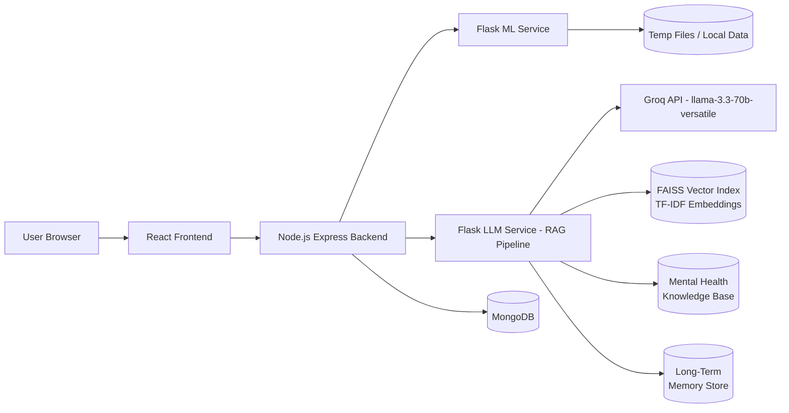

# MindPeace Project Documentation

Date: 2026-07-30

## 1. Project Overview

### Project Title
MindPeace

### Project Description
MindPeace is a production-oriented mental wellness platform that combines a React-based frontend, a Node.js and Express backend API gateway, a Flask ML service, and a Flask LLM gateway service. The platform supports user onboarding, mood tracking, journaling, personalized recommendations, challenges, positivity content, future letters, relaxation audio, and AI-assisted chat and emotion detection. The chat system is powered by a complete Retrieval-Augmented Generation (RAG) pipeline using Groq's llama-3.3-70b-versatile model, TF-IDF embeddings with FAISS vector search, and a persistent long-term memory system that remembers user context across sessions.

### Problem Statement
Many wellness applications fragment emotional support, habit building, and self-reflection across separate tools. Users often need one app for mood logging, another for guided exercises, and another for AI conversation or analysis. That fragmentation reduces engagement, weakens personalization, and makes it harder to build a complete wellness routine.

### Objectives
- Provide a single wellness workspace for emotional tracking and support.
- Personalize the experience through onboarding preferences and behavioral signals.
- Offer AI-assisted analysis for sentiment, emotion, recommendations, and chatbot support with RAG-enhanced context.
- Enable structured self-care workflows such as journaling, challenges, positivity interaction, and future letters.
- Deliver a production-ready architecture with clear service boundaries.

### Proposed Solution
The system uses a layered architecture:
- A React frontend for the user experience and stateful navigation.
- An Express backend that acts as the authenticated API gateway and persistence layer.
- A Flask ML service for sentiment, mood trend, recommendation, and analytics endpoints.
- A Flask LLM gateway service with a complete RAG pipeline that uses Groq's llama-3.3-70b-versatile model, TF-IDF + FAISS vector search, a structured mental health knowledge base, and a persistent memory system for cross-session context.
- MongoDB for primary application data, plus lightweight service-local storage where needed.

### Scope of the Project
Included:
- Authentication and onboarding
- Mood check-in and trend analysis
- Journaling and reflections
- Personalized recommendations
- Challenges and progress tracking
- Positivity content and interactions
- Future letters
- Nature sounds audio playback
- Chatbot support with RAG-powered context-aware conversations
- Face and voice emotion detection surfaces
- Admin and reporting endpoints

Excluded or limited in the current implementation:
- Full mobile-native app packaging
- Dedicated push notification infrastructure
- Human counselor workflow tools
- Advanced production observability stack beyond logging and health checks

## 2. Target Users

### User Types
- Standard end users seeking mental wellness support
- Returning users with saved preferences and history
- Admin users managing content, analytics, and system data
- Developers and operators validating services and deployments

### User Roles
- Guest: can access welcome and sign-in/sign-up surfaces only
- User: can use wellness modules after authentication and onboarding
- Admin: can manage catalog content, review analytics, and inspect logs

### User Requirements
- Secure account creation and login
- Guided onboarding for personalization
- Fast access to mood, journal, recommendations, and chat
- Accessible UI with responsive layouts
- Non-judgmental AI assistance and safe content handling

### Key User Scenarios
- A new user signs up, completes onboarding, and starts a mood check-in.
- A returning user opens the dashboard, reviews trend history, and journals thoughts.
- A user requests personalized recommendations based on wellness preferences.
- A user uses chat support and receives a streamed or standard AI response with context from past conversations and relevant mental health knowledge.
- An admin creates catalog content for challenges, positivity items, or recommendations.

## 3. Functional Requirements

### 3.1 Authentication and Session Management
**Feature Name:** Register and Login
- Description: Create an account and authenticate with JWT-backed session state.
- User Actions: Enter name, email, username, and password; sign in with email and password.
- Expected Outcome: A secure token is stored locally and the authenticated workspace becomes available.

**Feature Name:** Logout
- Description: End the authenticated session.
- User Actions: Click logout from the navigation or account controls.
- Expected Outcome: Local auth state is cleared and protected routes are no longer accessible.

**Feature Name:** Profile Retrieval
- Description: Load the current user profile after login.
- User Actions: Open the app or refresh the page.
- Expected Outcome: User context is restored and the dashboard reflects the saved account.

### 3.2 Onboarding and Personalization
**Feature Name:** Multi-step Onboarding
- Description: Capture goals, preferred activities, focus areas, and notification preferences.
- User Actions: Progress through setup screens and select preferences.
- Expected Outcome: The app stores onboarding completion and personalizes the experience.

**Feature Name:** Theme Preference
- Description: Persist light or dark theme selection.
- User Actions: Toggle theme from the UI.
- Expected Outcome: The chosen theme is applied and retained across sessions.

**Feature Name:** Language and Content Preferences
- Description: Store language and content preferences for future personalization.
- User Actions: Set language or preference values when prompted.
- Expected Outcome: Recommendations and UI can adapt to the selected profile.

### 3.3 Mood and Wellness Tracking
**Feature Name:** Daily Mood Check-in
- Description: Capture mood, energy level, optional notes, and detected emotion hints.
- User Actions: Select a mood, select an energy level, write notes, and submit.
- Expected Outcome: The mood record is stored and trend analytics are updated.

**Feature Name:** Mood Trend Analytics
- Description: Display recent mood series, rolling means, anomalies, and forecasts.
- User Actions: Open the dashboard or mood check-in page.
- Expected Outcome: The user sees trend visualizations and a direction label such as improving or stable.

**Feature Name:** Sentiment Analysis for Notes
- Description: Evaluate journal or mood-check text for emotional tone.
- User Actions: Enter text and trigger analysis.
- Expected Outcome: The app returns a label, intensity, keywords, and confidence-like metrics.

### 3.4 Journaling and Reflection
**Feature Name:** Journal Entries
- Description: Create, update, list, and delete reflective journal entries.
- User Actions: Write an entry, edit it later, or remove it.
- Expected Outcome: The entry is stored with mood and sentiment metadata.

**Feature Name:** Reflection Wall
- Description: Post reflections and react to community-style entries.
- User Actions: Submit a reflection and add reactions.
- Expected Outcome: Reflections are persisted with sentiment and reaction counts.

**Feature Name:** Future Letters
- Description: Schedule letters to the future self.
- User Actions: Write a letter and choose a delivery date.
- Expected Outcome: A scheduled record is created and can later be marked delivered.

### 3.5 Recommendations and Content Delivery
**Feature Name:** Personalized Recommendations
- Description: Return content items based on preferences, mood, and interaction history.
- User Actions: Open the recommendations page or dashboard widget.
- Expected Outcome: The user receives ranked content suggestions.

**Feature Name:** Recommendation Feedback
- Description: Capture user reactions to recommendations.
- User Actions: Like, dismiss, or rate suggested items.
- Expected Outcome: Feedback is stored for future ranking and model improvement.

**Feature Name:** Positivity Content Feed
- Description: Present quotes, affirmations, and prompts.
- User Actions: Browse content and interact with items.
- Expected Outcome: Interaction history is recorded and content can be tailored.

### 3.6 Goals, Challenges, and Engagement
**Feature Name:** Challenge Catalog and Progress
- Description: Offer self-care challenges with target progress and points.
- User Actions: Join a challenge and mark progress.
- Expected Outcome: Challenge state updates and progress is stored.

**Feature Name:** Points and Streaks
- Description: Reward healthy engagement with points, badges, and streaks.
- User Actions: Complete qualifying actions.
- Expected Outcome: Local user progress metrics are updated.

### 3.7 Media and Relaxation
**Feature Name:** Nature Sounds Player
- Description: Play calming ambient audio tracks.
- User Actions: Select a track, play, pause, or change volume.
- Expected Outcome: Audio playback runs in the shared audio context.

**Feature Name:** Audio Recommendations
- Description: Suggest nature sounds based on recommendation results.
- User Actions: Open the Nature Sounds page.
- Expected Outcome: Relevant audio items are promoted when available.

### 3.8 AI-assisted Support
**Feature Name:** Chatbot Conversations
- Description: Offer therapeutic-style AI chat with streaming support, RAG-enhanced context from mental health knowledge base, and persistent long-term memory that remembers user details across sessions.
- User Actions: Enter a message and send it to the chatbot.
- Expected Outcome: The assistant returns a supportive response with relevant knowledge context, personalized memories, and risk level.

**Feature Name:** Face Emotion Detection
- Description: Analyze a webcam image for facial emotion.
- User Actions: Allow camera access and capture a frame.
- Expected Outcome: The system returns the dominant emotion and confidence.

**Feature Name:** Voice Emotion Detection
- Description: Provide a voice-based emotion analysis workflow.
- User Actions: Record voice or submit audio.
- Expected Outcome: The backend returns emotion analysis when enabled; the current ML service build returns a not-enabled response for the direct endpoint.

### 3.9 Administrative Functions
**Feature Name:** Admin Analytics
- Description: View system metrics and activity summaries.
- User Actions: Open admin dashboards.
- Expected Outcome: Administrative insight into users, conversations, and logs.

**Feature Name:** Content Management
- Description: Create catalog items for challenges, recommendations, and positivity content.
- User Actions: Add admin-managed items.
- Expected Outcome: New content is available to users.

## 4. Non-Functional Requirements

### Performance Requirements
- API responses for common actions should remain low-latency under normal load.
- Chat responses should stream when possible to improve perceived responsiveness.
- RAG retrieval (TF-IDF vector search) should complete within milliseconds to avoid adding latency to chat responses.
- Frontend routes use lazy loading to reduce initial bundle size.

### Scalability Requirements
- The system should scale horizontally at the service layer.
- MongoDB should support growing history and analytics data.
- The ML and LLM services should be independently deployable and replaceable.
- The FAISS index can be rebuilt or persisted as the knowledge base grows.

### Security Requirements
- Authentication must be token-based and protected by middleware.
- Passwords must be hashed before storage.
- CORS must restrict origins to known frontend hosts.
- Rate limiting should reduce brute-force and abuse risk.
- AI prompts and responses should include safety-aware constraints.
- Groq API keys must be stored in environment variables, never in code.

### Reliability Requirements
- Service health endpoints should expose readiness status.
- Backend proxying should return clear upstream-failure responses.
- Frontend error boundaries should prevent full-app crashes.
- The RAG pipeline must degrade gracefully if Groq API is unreachable, returning a fallback message rather than crashing.

### Availability Requirements
- The core stack should remain functional even if the ML service is temporarily degraded.
- The LLM service should return explicit errors if Groq API is not reachable.
- Fallback recommendation behavior should keep the user experience usable.

### Usability Requirements
- The UI should be responsive on mobile and desktop.
- Core actions should be discoverable from the dashboard and navigation.
- The app should provide clear loading and empty-state feedback.

## 5. System Architecture

### High-Level Architecture


### Architecture Explanation
The frontend owns presentation, client-side routing, and local UI state. The backend owns authentication, authorization, persistent application data, and API gateway responsibilities. The ML service provides analytical endpoints and recommendation logic. The LLM gateway isolates chat orchestration from the Node backend and implements a complete RAG pipeline: it retrieves relevant mental health knowledge via TF-IDF + FAISS vector search, loads user-specific long-term memories from persistent JSONL storage, and augments the prompt sent to Groq's llama-3.3-70b-versatile model. MongoDB stores users, wellness records, chat history, analysis results, and catalog content.

### Component Overview
- Frontend: React, Vite, Tailwind CSS, React Router, Framer Motion, Lucide icons.
- Backend: Express, Mongoose, JWT, bcryptjs, multer, socket.io, http-proxy-middleware.
- ML Service: Flask, VADER, DeepFace, OpenCV, NumPy, pandas, scikit-learn, sentence-transformers, Prophet, LightFM, scikit-surprise.
- LLM Service: Flask, Groq Python SDK, scikit-learn (TF-IDF), FAISS, NumPy, JSONL memory store.
- Data Layer: MongoDB plus service-local JSONL (memories, chat history), FAISS index (vector search), and media assets.

### Data Flow Diagram Description
1. A user interacts with the React frontend.
2. The frontend sends authenticated requests to the Express backend.
3. The backend reads or writes MongoDB data and forwards specialized calls to ML services.
4. The ML service performs analysis and returns structured JSON.
5. The LLM service retrieves mental health knowledge via TF-IDF + FAISS, loads user memories from JSONL, builds an augmented prompt, and invokes Groq's llama-3.3-70b-versatile model for chat generation and risk classification.
6. Results are rendered back in the UI and may update persistent records.

### Request-Response Flow
- Login: frontend -> backend auth route -> JWT response -> local session storage.
- Mood check-in: frontend -> backend mood or wellness endpoint -> persistence -> ML sentiment/trend analysis -> dashboard update.
- Chat: frontend -> backend chat endpoint -> LLM service -> [RAG: knowledge retrieval + memory load] -> Groq API -> streamed or standard response with risk analysis.
- Recommendations: frontend -> backend recommendations endpoint -> ML service or local catalog logic -> ranked list.

### End-to-End Workflow
1. The user opens the welcome page.
2. The user registers or logs in.
3. The app restores session and checks onboarding completion.
4. The user completes onboarding preferences.
5. The dashboard loads personalized widgets, trends, and recommendations.
6. The user logs moods, journals, chats, takes challenges, or plays audio.
7. The backend persists activity and the ML services enrich the data.
8. The user returns later to continue the wellness journey with accumulated context. The LLM service recalls past conversations and user details from the memory store.

## 6. Technology Stack

### Frontend

| Technology Name | Purpose | Why It Was Selected |
| --- | --- | --- |
| React 18 | UI rendering and component architecture | Mature, flexible, and suited to reusable wellness surfaces |
| Vite | Build tool and dev server | Fast development startup and production bundling |
| React Router | Route management | Clean public/protected route separation |
| Tailwind CSS | Styling | Rapid design iteration and responsive utilities |
| Framer Motion | Animation | Lightweight motion for polished interaction |
| Lucide React and Heroicons | Icons | Consistent iconography with minimal overhead |
| React Context | State management | Good fit for theme, user, and audio state |

### Backend

| Technology Name | Purpose | Why It Was Selected |
| --- | --- | --- |
| Express | HTTP API framework | Simple, widely adopted, easy to compose with middleware |
| Node.js | Runtime environment | Good fit for gateway logic and JSON APIs |
| JWT | Authentication tokens | Stateless session handling across browser and services |
| bcryptjs | Password hashing | Secure password storage without external dependencies |
| Mongoose | MongoDB object modeling | Strong schema validation and model organization |
| socket.io | Real-time transport | Supports live chat and future realtime features |
| multer | File upload middleware | Handles emotion-detection media payloads |
| http-proxy-middleware | API proxying | Preserves legacy ML API contracts during migration |

### Database

| Technology Name | Purpose | Why It Was Selected |
| --- | --- | --- |
| MongoDB | Primary application store | Flexible document model for user wellness data |
| SQLite | Lightweight game/session persistence | Suitable for local feature-level state in the ML service |
| JSONL / filesystem storage | Fallback analytics, temporary storage, memory persistence | Simple runtime persistence for ML-service-local artifacts and long-term memory |
| FAISS index (local) | Vector search for knowledge retrieval | Fast similarity search on TF-IDF embeddings without external vector DB dependencies |
| Local audio assets | Nature sound playback | Offline-friendly media delivery |

### AI/ML Technologies

| Technology Name | Purpose | Why It Was Selected |
| --- | --- | --- |
| VADER | Fast sentiment analysis | Lightweight and effective for short wellness text |
| DeepFace | Facial emotion analysis | Practical off-the-shelf face emotion inference |
| OpenCV | Image decoding and preprocessing | Stable image handling for detection workflows |
| sentence-transformers | Semantic embeddings | Strong base for similarity and recommendation tasks |
| Prophet | Trend forecasting | Suitable for time-series mood forecasting |
| LightFM and scikit-surprise | Recommendation modeling | Collaborative and hybrid recommender support |
| Groq API | Cloud LLM inference | Ultra-low latency inference for llama-3.3-70b-versatile |
| Llama 3.3 70B via Groq | Chat generation | State-of-the-art reasoning with fast inference speed |
| scikit-learn (TF-IDF) | Text vectorization for RAG | Lightweight, deterministic embedding for knowledge retrieval |
| FAISS | Approximate nearest neighbor search | Fast vector similarity search on TF-IDF embeddings |

### LLM Service RAG Stack

| Technology Name | Purpose | Why It Was Selected |
| --- | --- | --- |
| Groq Python SDK | Cloud LLM API client | Official SDK for Groq's ultra-low-latency inference |
| scikit-learn TfidfVectorizer | Text-to-vector embedding | Lightweight, deterministic, no GPU needed |
| FAISS | Vector similarity search | Fast ANN search on CPU, no external vector DB dependency |
| JSONL file store | Long-term memory persistence | Simple append-only log, easy to debug and extend |
| Python datetime + UUID | Memory indexing and retrieval | Standard library, no extra dependencies |

## 7. Feature-wise Technology Mapping

| Feature | Frontend Technology | Backend Technology | Database | AI/ML Model | APIs/Services |
| --- | --- | --- | --- | --- | --- |
| Authentication | React forms, context, routing | Express auth routes, JWT, bcryptjs | User, Session | None | /auth/login, /auth/register, /auth/me |
| Onboarding | React stepper UI | User and preferences routes | User, UserPreference | None | /api/v1/users/me, /api/v1/preferences/me |
| Dashboard | React components, charts | User, wellness, recommendations routes | User, JournalEntry, Challenge progress | Trend analytics, recommender | /api/v1/users/me, /api/v1/recommendations/me, /api/mood/trends |
| Mood check-in | Mood UI, sentiment cards, emotion detector | Wellness and emotion routes | JournalEntry, EmotionAnalysis | VADER, DeepFace | /api/mood/submit, /api/mood/trends, /api/v1/emotion/face |
| Journaling | Text entry UI | Wellness route | JournalEntry | VADER / advanced sentiment | /api/v1/wellness/journal, /sentiment/v2/analyze |
| Recommendations | Recommendation page | Recommendation routes | RecommendationCatalog, RecommendationFeedback | Hybrid recommender, embeddings | /api/v1/recommendations/me, /api/reco/recommendations |
| Challenges | Challenge UI | Challenge routes | ChallengeCatalog, UserChallengeProgress | None / future ranking | /api/v1/challenges/catalog, /api/v1/challenges/me |
| Activities | Activity modules | Games endpoints via ML service | SQLite games DB | None | /api/games/* |
| Reflection wall | Feed UI | Wellness route | Reflection | Sentiment analysis | /api/v1/wellness/reflections |
| Positivity drops | Cards and filters | Positivity routes | PositivityContent, PositivityInteraction | Embedding or ranking support | /api/v1/positivity/content |
| Future letters | Letter composer | Wellness route | FutureLetter | None | /api/v1/wellness/future-letters |
| Nature sounds | Audio player/context | Recommendations route | RecommendationCatalog | Hybrid recommender | /api/v1/recommendations/catalog |
| Chatbot (RAG) | Chat UI, speech controls | Chat routes, LLM service bridge | Conversation, AnalysisResult, memory JSONL, FAISS index | Groq llama-3.3-70b-versatile, TF-IDF + FAISS | /api/v1/chat/*, /api/chat, /llm/* |
| Face emotion | Webcam component | Emotion route, ML service | EmotionAnalysis | DeepFace | /api/v1/emotion/face, /api/detect-face-emotion |
| Voice emotion | Voice detector UI | Emotion route | EmotionAnalysis | Audio models placeholder / future extension | /api/v1/emotion/voice |
| Admin console | Admin pages and utilities | Admin routes | ReportLog, User, Conversation | Analytics models | /api/v1/admin/* |

## 8. System Flow

### User Flow
1. Open the welcome page.
2. Register or log in.
3. Complete onboarding preferences.
4. Land on the dashboard.
5. Check mood, review trends, and interact with wellness modules.
6. Save journal entries, complete challenges, and read recommendations.
7. Use chatbot (with RAG-powered knowledge and memory), nature sounds, reflection wall, future letters, or emotion detection as needed.

### Admin Flow
1. Authenticate as an admin user.
2. Open the admin area.
3. Review users, conversations, analytics, and logs.
4. Create or manage catalog items for challenges, positivity content, and recommendations.
5. Monitor service health and content activity.

### AI Processing Flow
1. A user submits text, image, or chat input.
2. The frontend forwards the payload to the backend or ML/LLM service.
3. For chat: The LLM service retrieves relevant knowledge via TF-IDF + FAISS, loads user memories, builds an augmented prompt with structured format instructions.
4. The LLM service invokes Groq's llama-3.3-70b-versatile model with the augmented prompt.
5. The model returns a structured response with content, risk level, and suggested resources.
6. The backend persists the conversation, analysis, and updates memories.
7. The frontend renders the AI output in a structured view.

### Complete Workflow
1. Login or register.
2. Restore or create a JWT-backed session.
3. Complete onboarding.
4. Load dashboard widgets from the backend and ML service.
5. Interact with mood, journal, recommendation, challenge, positivity, audio, and chat features.
6. Persist state in MongoDB or service-local storage (memories, chat history).
7. Continue the wellness loop through repeat visits and personalized feedback.

## 9. Module Description

### Authentication Module
- Purpose: Handle sign-up, login, logout, and session restoration.
- Responsibilities: Credential verification, token issuance, and guarded access.
- Features: Register, login, me, profile, logout.
- Inputs: Email, username, password, bearer token.
- Outputs: Authenticated user profile and session state.
- Dependencies: JWT, bcryptjs, User and Session models.

### User Management Module
- Purpose: Manage profile and preference data.
- Responsibilities: Load/update profile, update preferences, change password, deactivate account.
- Features: Profile retrieval, preference updates, password change.
- Inputs: User ID, profile fields, preference payloads.
- Outputs: Updated user object and settings.
- Dependencies: User, UserPreference.

### Dashboard Module
- Purpose: Provide the central wellness overview.
- Responsibilities: Aggregate trends, recommendations, and progress cues.
- Features: Greeting, quick actions, insights, charts, summaries.
- Inputs: Authenticated user context and analytics data.
- Outputs: Dashboard widgets and navigation entry points.
- Dependencies: UserContext, MoodTrendChart, recoAPI, mood API.

### AI Engine Module
- Purpose: Power natural language and emotion workflows.
- Responsibilities: Sentiment analysis, recommendations, face emotion analysis, RAG-enhanced LLM chat, long-term memory management.
- Features: Sentiment, mood trends, face emotion, RAG-powered chat responses, recommendation ranking, memory persistence.
- Inputs: Text, image, conversation history, user context, chat history from past sessions.
- Outputs: Labels, confidence, rankings, streamed tokens, risk summaries, memory extracts.
- Dependencies: Flask ML service, Flask LLM service (RAG pipeline), Groq API, DeepFace, VADER, FAISS, TF-IDF.

### Notification Module
- Purpose: Support reminders and nudges.
- Responsibilities: Preference storage and future notification wiring.
- Features: Notification toggles, reminder time capture.
- Inputs: User preference data.
- Outputs: Stored notification settings.
- Dependencies: UserContext and UserPreference.

### Analytics Module
- Purpose: Measure sentiment, trends, and recommendation behavior.
- Responsibilities: Mood aggregation, evaluation, and logging.
- Features: Trend series, anomalies, model metrics, admin analytics.
- Inputs: Mood entries, feedback, analysis records.
- Outputs: Chart-ready data and report logs.
- Dependencies: Mood store, analytics blueprints, ReportLog.

### Reporting Module
- Purpose: Expose summarized operational and content insight.
- Responsibilities: Log retrieval, system review, content review.
- Features: Admin analytics and logs.
- Inputs: Service events, user records, chat summaries.
- Outputs: Administrative reports.
- Dependencies: Admin routes, ReportLog, Conversation.

### RAG Engine Module
- Purpose: Power knowledge-augmented chat responses with long-term memory.
- Responsibilities: Knowledge retrieval from structured mental health base, user memory persistence and recall, prompt augmentation, response formatting.
- Features: TF-IDF vectorization, FAISS similarity search, memory save/load, structured system prompt injection.
- Inputs: User message, user ID, conversation history.
- Outputs: Augmented prompt, retrieved knowledge snippets, relevant memories.
- Dependencies: scikit-learn (TF-IDF), FAISS, JSONL memory store, prompt templates.

## 10. Database Design

### MongoDB Collections

| Table / Collection | Purpose | Fields | Data Types | Constraints | Relationships |
| --- | --- | --- | --- | --- | --- |
| User | Account and profile storage | fullName, email, username, passwordHash, role, isActive, preferences | String, Boolean, Object | email and username unique; role enum | Referenced by all user-owned records |
| Session | Token/session tracking | userId, tokenId, userAgent, ipAddress, expiresAt, revokedAt | ObjectId, String, Date | tokenId unique; userId required | Many sessions belong to one user |
| Conversation | Chat history storage | userId, title, mode, status, messages, latestAnalysisId | ObjectId, String, Array, ObjectId | userId required; status enum | References User and AnalysisResult |
| AnalysisResult | Per-message AI analysis | userId, conversationId, messageText, sentiment, emotion, risk, llmMeta | ObjectId, String, Mixed | userId and conversationId required | Links user chat messages to analysis output |
| EmotionAnalysis | Face or voice emotion analysis | userId, modality, primaryEmotion, confidence, raw | ObjectId, String, Number, Mixed | modality enum | Links to user and modality-based analysis |
| JournalEntry | Private journal entries | userId, mood, content, sentiment | ObjectId, String, Mixed | content required | Belongs to one user |
| Reflection | Reflection wall posts | userId, text, category, sentiment, reactions, anonymous | ObjectId, String, Mixed, Boolean | text required | Belongs to one user |
| FutureLetter | Scheduled letters | userId, title, content, deliveryDate, status, deliveredAt | ObjectId, String, Date | deliveryDate required; status enum | Belongs to one user |
| ChallengeCatalog | Challenge definitions | slug, title, description, difficulty, points, target, active, tags | String, Number, Array | slug unique; difficulty enum | Referenced by user challenge progress |
| UserChallengeProgress | User challenge state | userId, challengeId, progress, target, state, startedAt, completedAt | ObjectId, Number, Date | compound unique userId + challengeId | Links User and ChallengeCatalog |
| RecommendationCatalog | Recommended content catalog | itemType, title, description, tags, language, metadata, active | String, Array, Mixed | itemType enum; active indexed | Referenced by feedback and recommendation logic |
| RecommendationFeedback | User feedback on recommendations | userId, itemId, rating, action, context | ObjectId, Number, Mixed | action enum | Links User and RecommendationCatalog |
| PositivityContent | Motivational content store | contentType, text, author, tags, language, active | String, Array, Boolean | contentType enum | Used by positivity feed |
| PositivityInteraction | User interactions with positivity items | userId, contentId, action, context | ObjectId, String, Mixed | action enum | Links User and PositivityContent |
| UserPreference | Onboarding and personalization profile | userId, interests, goals, moodPatterns, activityPreferences, language, onboardingVersion | ObjectId, Array, String | userId unique | One preference record per user |
| ReportLog | Audit/report events | userId, type, level, message, data | ObjectId, String, Mixed | level enum | Used by admin and operational reporting |

### SQLite Tables in ML Games Store

| Table Name | Purpose | Fields | Data Types | Constraints | Relationships |
| --- | --- | --- | --- | --- | --- |
| users | Local game-user registry | id, created_at | Text | id primary key | One user to many sessions and preferences |
| sessions | Game session tracking | id, user_id, game, started_at, ended_at, duration | Text, Integer | id primary key | Belongs to users |
| events | Game event logging | id, session_id, game, type, payload, ts | Text | id primary key | Belongs to sessions |
| scores | Highest score tracking | user_id, game, high_score, updated_at | Text, Integer | composite primary key user_id + game | Belongs to users |
| preferences | Game preferences | user_id, game, data, updated_at | Text | composite primary key user_id + game | Belongs to users |
| zen_saves | Zen garden image saves | id, user_id, image_path, theme, rake_width, created_at | Text, Integer | id primary key | Belongs to users |

### Local File Storage (LLM Service)

| Store | Purpose | Format | Location | Key Structure |
| --- | --- | --- | --- | --- |
| Memory Store | Long-term user memory | JSONL | llm_service/data/memories.jsonl | timestamp, session_id, user_id, category, content, summary |
| Chat History | Message-level conversation log | JSONL | llm_service/data/chat_history.jsonl | timestamp, session_id, user_id, role, content, metadata |
| FAISS Index | Vector search index | .faiss binary | llm_service/data/faiss_index.bin | TF-IDF vectors for knowledge base chunks |
| TF-IDF Vectors | Text embedding transformation | .pkl | llm_service/data/tfidf_vectorizer.pkl | Fitted TfidfVectorizer |

### Entity Relationships
- One user can own many conversations, journal entries, reflections, letters, emotions, challenges, feedback records, positivity interactions, and memory records.
- One conversation can have many messages and many analysis results.
- One challenge catalog item can have many user challenge progress records.
- One recommendation catalog item can have many feedback records.
- One positivity content item can have many interactions.
- One user can have many memory entries (stored as JSONL, linked by user_id).

## 11. API Documentation

### Backend Core APIs

| Endpoint URL | HTTP Method | Description | Request Parameters | Request Body | Response Format | Status Codes | Authentication Requirements |
| --- | --- | --- | --- | --- | --- | --- | --- |
| / | GET | Backend root health check | None | None | { ok, message } | 200 | None |
| /api/v1/health | GET | Backend health check | None | None | Health payload | 200 | None |
| /api/v1/auth/register | POST | Register new user | None | fullName, email, username, password | Auth response | 201, 400, 409 | None |
| /api/v1/auth/login | POST | Login user | None | email, password | Auth response | 200, 400, 401 | None |
| /api/v1/auth/me | GET | Current user | None | None | User profile | 200, 401 | Bearer JWT |
| /api/v1/auth/profile | GET | Current profile | None | None | Profile payload | 200, 401 | Bearer JWT |
| /api/v1/auth/logout | POST | Logout user | None | None | Logout status | 200, 401 | Bearer JWT |
| /api/v1/users/me | GET | Load current user | None | None | User payload | 200, 401 | Bearer JWT |
| /api/v1/users/me | PATCH | Update profile | None | Profile updates | Updated user | 200, 400, 401 | Bearer JWT |
| /api/v1/users/me/preferences | PATCH | Update preferences | None | Preference updates | Updated preferences | 200, 400, 401 | Bearer JWT |
| /api/v1/users/me/password | POST | Change password | None | current_password, new_password | Status payload | 200, 400, 401 | Bearer JWT |
| /api/v1/users/me | DELETE | Deactivate account | None | password | Status payload | 200, 400, 401 | Bearer JWT |

### Wellness and Content APIs

| Endpoint URL | HTTP Method | Description | Request Parameters | Request Body | Response Format | Status Codes | Authentication Requirements |
| --- | --- | --- | --- | --- | --- | --- | --- |
| /api/v1/wellness/journal | GET | List journal entries | limit | None | Array of journal entries | 200, 401 | Bearer JWT |
| /api/v1/wellness/journal | POST | Create journal entry | None | mood, content, sentiment | Entry payload | 201, 400, 401 | Bearer JWT |
| /api/v1/wellness/journal/:id | PATCH | Update journal entry | id | Update fields | Entry payload | 200, 400, 401, 404 | Bearer JWT |
| /api/v1/wellness/journal/:id | DELETE | Delete journal entry | id | None | Status payload | 200, 401, 404 | Bearer JWT |
| /api/v1/wellness/reflections | GET | List reflections | category, limit | None | Array of reflections | 200, 401 | Bearer JWT |
| /api/v1/wellness/reflections | POST | Create reflection | None | text, category, sentiment, anonymous | Reflection payload | 201, 400, 401 | Bearer JWT |
| /api/v1/wellness/reflections/:id/reactions | POST | Add reflection reaction | id | reaction | Status payload | 200, 400, 401 | Bearer JWT |
| /api/v1/wellness/future-letters | GET | List letters | None | None | Array of letters | 200, 401 | Bearer JWT |
| /api/v1/wellness/future-letters | POST | Create letter | None | title, content, deliveryDate | Letter payload | 201, 400, 401 | Bearer JWT |

### Challenges, Recommendations, and Positivity APIs

| Endpoint URL | HTTP Method | Description | Request Parameters | Request Body | Response Format | Status Codes | Authentication Requirements |
| --- | --- | --- | --- | --- | --- | --- | --- |
| /api/v1/challenges/catalog | GET | List challenge catalog | None | None | Array of challenges | 200, 401 | Bearer JWT |
| /api/v1/challenges/me | GET | List my challenges | None | None | Array of progress records | 200, 401 | Bearer JWT |
| /api/v1/challenges/me/start | POST | Start challenge | None | challengeId | Progress payload | 201, 400, 401 | Bearer JWT |
| /api/v1/challenges/me/:id | PATCH | Update challenge progress | id | progress | Progress payload | 200, 400, 401 | Bearer JWT |
| /api/v1/challenges/catalog | POST | Create challenge | None | Challenge definition | Challenge payload | 201, 401, 403 | Admin JWT |
| /api/v1/recommendations/catalog | GET | List recommendation catalog | type, language, limit | None | Array of catalog items | 200, 401 | Bearer JWT |
| /api/v1/recommendations/me | GET | Get personalized recommendations | topN, mood | None | Recommendation payload | 200, 401 | Bearer JWT |
| /api/v1/recommendations/feedback | POST | Submit recommendation feedback | None | itemId, rating, action, context | Status payload | 200, 400, 401 | Bearer JWT |
| /api/v1/recommendations/catalog | POST | Create catalog item | None | Catalog item | Item payload | 201, 401, 403 | Admin JWT |
| /api/v1/positivity/content | GET | List positivity content | type, language, limit | None | Array of items | 200, 401 | Bearer JWT |
| /api/v1/positivity/interactions | POST | Record interaction | None | contentId, action, context | Interaction payload | 201, 400, 401 | Bearer JWT |
| /api/v1/positivity/me/interactions | GET | List my interactions | None | None | Array of interactions | 200, 401 | Bearer JWT |
| /api/v1/positivity/content | POST | Create positivity content | None | Content definition | Content payload | 201, 401, 403 | Admin JWT |

### Emotion and Chat APIs

| Endpoint URL | HTTP Method | Description | Request Parameters | Request Body | Response Format | Status Codes | Authentication Requirements |
| --- | --- | --- | --- | --- | --- | --- | --- |
| /api/v1/emotion/voice | POST | Detect voice emotion | multipart audio | audio file | Emotion payload | 200, 400, 401 | Bearer JWT |
| /api/v1/emotion/face | POST | Detect face emotion | multipart image | image file | Emotion payload | 200, 400, 401 | Bearer JWT |
| /api/v1/emotion/me | GET | List my emotion analyses | None | None | Array of analyses | 200, 401 | Bearer JWT |
| /api/v1/chat/health | GET | Chat service health | None | None | Health payload | 200, 401 | Bearer JWT |
| /api/v1/chat/message | POST | Send chat message (with RAG) | None | message, history, mode | Chat payload | 200, 401, 429 | Bearer JWT |
| /api/v1/chat/send | POST | Alias for chat send (with RAG) | None | message, history, mode | Chat payload | 200, 401, 429 | Bearer JWT |
| /api/v1/chat/stream | POST | Stream chat response (with RAG) | None | message, history, mode | NDJSON stream | 200, 401, 429 | Bearer JWT |
| /api/v1/chat/conversations | GET | List conversations | None | None | Array of conversations | 200, 401 | Bearer JWT |
| /api/v1/chat/conversations/:id | GET | Get one conversation | id | None | Conversation payload | 200, 401, 404 | Bearer JWT |
| /api/v1/chat/conversations/:id | DELETE | Clear conversation | id | None | Status payload | 200, 401, 404 | Bearer JWT |
| /api/v1/chat/conversations/:id/assessment | GET | Get conversation assessment | id | None | Assessment payload | 200, 401, 404 | Bearer JWT |

### Admin APIs

| Endpoint URL | HTTP Method | Description | Request Parameters | Request Body | Response Format | Status Codes | Authentication Requirements |
| --- | --- | --- | --- | --- | --- | --- | --- |
| /api/v1/admin/users | GET | List users | None | None | Array of users | 200, 401, 403 | Admin JWT |
| /api/v1/admin/conversations | GET | List conversations | None | None | Array of conversations | 200, 401, 403 | Admin JWT |
| /api/v1/admin/analytics | GET | Admin analytics | None | None | Analytics payload | 200, 401, 403 | Admin JWT |
| /api/v1/admin/logs | GET | System logs | None | None | Array of logs | 200, 401, 403 | Admin JWT |

### ML Service APIs

| Endpoint URL | HTTP Method | Description | Request Parameters | Request Body | Response Format | Status Codes | Authentication Requirements |
| --- | --- | --- | --- | --- | --- | --- | --- |
| /api/health | GET | ML service health | None | None | Health payload | 200, 503 | None |
| /api/detect-face-emotion | POST | Detect face emotion | image or image_base64 | image payload | Emotion payload | 200, 400, 503 | None |
| /detect-emotion | POST | Face emotion alias | image or image_base64 | image payload | Emotion payload | 200, 400, 503 | None |
| /api/detect-emotion | POST | Voice emotion placeholder | None | None | Error payload | 501 | None |
| /api/mood-pattern/analyze/text | POST | Text mood analysis via blueprint | None | text payload | Mood analysis payload | 200, 400, 500 | None |
| /api/mood-pattern/analyze/face | POST | Face mood pattern analysis | image or image_base64 | image payload | Mood analysis payload | 200, 400, 503 | None |
| /api/mood-pattern/analyze/fusion | POST | Combined text/image mood analysis | model-specific payload | combined payload | Fusion payload | 200, 400, 503 | None |
| /api/sentiment/analyze | POST | Baseline sentiment analysis | None | text | Sentiment payload | 200, 400, 500 | None |
| /api/sentiment/analyze-batch | POST | Batch sentiment analysis | None | texts | Array payload | 200, 400, 500 | None |
| /api/sentiment/metrics | GET | Sentiment model metrics | None | None | Metrics payload | 200, 500 | None |
| /api/sentiment/v2/health | GET | Advanced sentiment service health | None | None | Service model info | 200, 500 | None |
| /api/sentiment/v2/analyze | POST | Advanced sentiment analysis | None | text, model, options | Sentiment payload | 200, 400, 503 | None |
| /api/sentiment/v2/analyze/batch | POST | Advanced batch sentiment | None | texts, model | Array payload | 200, 400, 500 | None |
| /api/sentiment/v2/models | GET | Model catalog | model | None | Model metadata | 200, 400 | None |
| /api/sentiment/v2/recommend | POST | Recommend sentiment model | None | use_case | Recommendation payload | 200, 400 | None |
| /api/sentiment/v2/compare | POST | Compare multiple models | None | text, models | Comparison payload | 200, 400 | None |
| /api/recommendations | POST | Embedding-based recommendations | None | query, k | Ranked item list | 200 | None |
| /api/reco/health | GET | Recommender health | None | None | Engine status | 200 | None |
| /api/reco/model-info | GET | Recommender info | None | None | Engine status | 200 | None |
| /api/reco/recommend | GET or POST | Get recommended items | user_id, top_n, strategy, alpha, mood | Optional JSON payload | Recommendation payload | 200, 400 | None |
| /api/reco/feedback | POST | Record recommendation feedback | None | user_id, item_id, rating, action, context | Status payload | 200, 400 | None |
| /api/reco/metrics | GET | Evaluate recommendation model | k, strategy | None | Metrics payload | 200 | None |
| /api/games/session/start | POST | Start game session | None | userId, game | Session payload | 200, 400 | None |
| /api/games/session/stop | POST | Stop game session | None | sessionId | Duration payload | 200, 400, 404 | None |
| /api/games/event | POST | Log game event | None | sessionId, game, type, payload | Event payload | 200, 400 | None |
| /api/games/bubble/score | POST | Submit bubble game score | None | userId, score | Score payload | 200, 400 | None |
| /api/games/preferences | POST | Store game preferences | None | userId, game, preferences | Status payload | 200, 400 | None |
| /api/games/state | GET | Read game state | userId, game | None | State payload | 200 | None |
| /api/games/zen/save | POST | Save zen garden image | None | userId, imageData, theme, rakeWidth | Status payload | 200, 400 | None |
| /api/games/zen/list | GET | List zen saves | userId | None | Array of saves | 200 | None |

### LLM Service APIs (RAG Pipeline)

| Endpoint URL | HTTP Method | Description | Request Parameters | Request Body | Response Format | Status Codes | Authentication Requirements |
| --- | --- | --- | --- | --- | --- | --- | --- |
| /health | GET | LLM gateway health | None | None | Health payload with RAG status | 200, 503 | None |
| /api/chat | POST | Generate chat response via Groq with RAG | None | message, history, mode, user_id, temperature, max_tokens | Chat response with RAG context | 200, 400, 503 | None |
| /chat | POST | Chat alias (RAG-enhanced) | None | message, history, mode, user_id | Chat response | 200, 400, 503 | None |
| /api/chat/stream | POST | Stream chat tokens with RAG | None | message, history, mode, user_id | NDJSON stream | 200, 400, 503 | None |
| /api/chat/memory | POST | Save a memory entry | None | user_id, session_id, category, content, summary | Memory payload | 200, 400 | None |
| /api/chat/memory/retrieve | POST | Retrieve user memories | None | user_id, session_id, limit | Array of memory entries | 200, 400 | None |
| /api/chat/knowledge | POST | Query the knowledge base directly | None | query, k (number of results) | Array of knowledge snippets | 200, 400 | None |

## 12. Security Architecture

### Authentication Flow
1. The user submits credentials through the frontend.
2. The backend validates the credentials and issues a JWT.
3. The frontend stores the token locally and includes it in Authorization headers.
4. Protected endpoints use middleware to verify token validity.

### Authorization (RBAC)
- Role values are modeled as user and admin.
- Admin routes are protected with role checks.
- Non-admin users can access only their own records.

### JWT / OAuth Implementation
- The system uses JWT bearer tokens for session continuity.
- Token settings are configured centrally in backend environment configuration.
- OAuth is not implemented in the current codebase.

### Password Security
- Passwords are hashed with bcrypt before persistence.
- Password comparison is done with bcrypt compare helpers.
- Plaintext passwords are never stored.

### Data Encryption
- TLS termination should be enabled at the deployment layer.
- Sensitive credentials should live in environment variables (including Groq API key).
- MongoDB and service communication should be secured in production deployments.

### API Security
- Helmet hardens HTTP headers.
- CORS restricts allowed origins.
- Rate limiting is applied to login and chat-heavy routes.
- JSON body size is capped in the backend.

### Input Validation
- Route handlers validate required fields before processing.
- Sentiment and recommendation endpoints reject empty payloads.
- Upload handlers enforce file-size limits.

### Rate Limiting
- Authentication endpoints use tighter request limits.
- Chat endpoints use per-route rate limiting to reduce abuse.

### Audit Logging
- Proxy failures and upstream responses are logged.
- Administrative report logs can store structured events.
- ML services emit operational logs for inference and health events.

### Secure File Handling
- Uploaded emotion media is handled in memory rather than written blindly to disk.
- The ML service accepts either multipart images or base64 payloads.
- Audio playback uses curated local assets.

### AI Safety Guardrails
- The system prompt instructs the LLM to be empathetic, non-judgmental, and avoid harmful guidance.
- The LLM service classifies risk levels from user and assistant text.
- High-risk cues can be surfaced for escalation or extra caution.
- The RAG pipeline only retrieves from a curated mental health knowledge base, reducing the risk of harmful content.
- The Groq API key is stored in environment variables and never exposed in code.

## 13. AI/ML Components

### 13.1 Chat Assistant (RAG Pipeline)
**Feature Name:** Mental Health Chatbot with Retrieval-Augmented Generation
- AI Capability Required: Conversational support with risk-aware responses, augmented by domain-specific knowledge retrieval and long-term user memory.
- Recommended Model(s): Llama 3.3 70B via Groq API for fast, high-quality cloud inference.
- Why the Model Was Selected: State-of-the-art reasoning quality, ultra-low latency via Groq's LPU inference engine, and strong safety alignment out of the box.
- Alternative Models: Llama 3.1 70B, Mixtral 8x7B, Gemma 2 27B (all via Groq).
- Input Format: User message, conversation history, chat mode, user ID (for memory retrieval).
- Output Format: Assistant response (content), model name, risk level, retrieved knowledge snippets.
- Dataset Requirements: Curated mental health knowledge base (anxiety, depression, stress, self-care, sleep, relationships, grief, mindfulness); user memory from prior sessions.
- Training Requirements: No fine-tuning required; prompt engineering and RAG augmentation provide domain alignment.
- RAG Workflow:
  1. User message is received with user_id and conversation history.
  2. TF-IDF vectorizer transforms the message into a query vector.
  3. FAISS index searches the top-k most similar knowledge base chunks.
  4. Memory manager loads relevant memories for the user from JSONL store.
  5. System prompt is augmented with retrieved knowledge and formatted memories.
  6. Augmented prompt is sent to Groq's llama-3.3-70b-versatile for generation.
  7. Response is parsed for content, risk level, and follow-up suggestions.
  8. Conversation and memory are persisted for future retrieval.
- Inference Workflow: The backend forwards the request to the LLM service, which performs RAG retrieval, augments the prompt, calls Groq API, and returns a structured response or stream.
- Evaluation Metrics: Helpfulness, safety, latency, refusal correctness, coherence, knowledge grounding accuracy.
- Hardware Requirements: None locally (cloud inference via Groq API); CPU sufficient for TF-IDV/FAISS retrieval.
- Estimated Resource Consumption: Low (TF-IDF and FAISS are CPU-light; Groq handles model inference).

### 13.2 Sentiment Analysis
**Feature Name:** Text Sentiment and Emotion Tone
- AI Capability Required: Lightweight sentiment classification.
- Recommended Model(s): VADER for fast default analysis; optionally a distilled transformer or fine-tuned classifier for richer labels.
- Why the Model Was Selected: Low latency and reliable for short user-generated text.
- Alternative Models: DistilBERT, RoBERTa-based sentiment classifiers, BiLSTM.
- Input Format: Free text.
- Output Format: Label, intensity, compound score, keywords.
- Dataset Requirements: Labeled mental-health and general sentiment corpora.
- Training Requirements: Optional supervised fine-tuning for domain adaptation.
- Fine-Tuning Requirements: Better sensitivity to wellness-specific wording.
- Inference Workflow: The ML service analyzes the text and returns structured sentiment results.
- Evaluation Metrics: F1, precision, recall, calibration, latency.
- Hardware Requirements: CPU-friendly by default.
- Estimated Resource Consumption: Low for VADER, moderate for transformer models.

### 13.3 Face Emotion Detection
**Feature Name:** Webcam Emotion Detection
- AI Capability Required: Computer vision emotion classification.
- Recommended Model(s): DeepFace emotion model for a practical baseline.
- Why the Model Was Selected: Easy integration and broad support for facial emotion inference.
- Alternative Models: MediaPipe + custom classifier, FER models, EfficientNet-based detectors.
- Input Format: Image frame or base64 image.
- Output Format: Dominant emotion and confidence.
- Dataset Requirements: Facial emotion datasets such as FER-2013 or RAF-DB.
- Training Requirements: Optional fine-tuning for improved accuracy in target demographics.
- Fine-Tuning Requirements: Face-domain adaptation and bias evaluation.
- Inference Workflow: The frontend sends an image; the ML service decodes it and runs the detector.
- Evaluation Metrics: Accuracy, macro F1, confidence calibration.
- Hardware Requirements: CPU works; GPU improves throughput.
- Estimated Resource Consumption: Moderate.

### 13.4 Voice Emotion Detection
**Feature Name:** Speech Emotion Analysis
- AI Capability Required: Audio emotion recognition.
- Recommended Model(s): wav2vec2-based emotion classifier or a fine-tuned CNN-RNN audio model.
- Why the Model Was Selected: Better than raw heuristics for emotionally nuanced speech.
- Alternative Models: HuBERT emotion models, OpenSMILE feature pipelines, Whisper-based auxiliary analysis.
- Input Format: Audio clip or streamed voice capture.
- Output Format: Emotion label and confidence.
- Dataset Requirements: RAVDESS, CREMA-D, IEMOCAP, or domain-specific speech data.
- Training Requirements: Fine-tuned supervised classification.
- Fine-Tuning Requirements: Noise robustness and accent diversity.
- Inference Workflow: The backend uploads audio; the model returns emotion predictions.
- Evaluation Metrics: Weighted F1, confusion matrix, latency.
- Hardware Requirements: CPU for light use, GPU for larger deployments.
- Estimated Resource Consumption: Moderate to high.

### 13.5 Recommendation Engine
**Feature Name:** Wellness Recommendations
- AI Capability Required: Ranking and personalization.
- Recommended Model(s): Hybrid recommender using collaborative filtering plus content-based embeddings.
- Why the Model Was Selected: Balances personalization with cold-start resilience.
- Alternative Models: LightFM, matrix factorization, transformer-based rankers.
- Input Format: User ID, mood context, interaction history.
- Output Format: Ranked item list with scores.
- Dataset Requirements: Item catalog, user interactions, feedback.
- Training Requirements: Regular model refresh with interaction data.
- Fine-Tuning Requirements: Context weighting and feedback calibration.
- Inference Workflow: The recommender ranks catalog items and returns a simplified payload for the frontend.
- Evaluation Metrics: NDCG, precision@k, recall@k, coverage.
- Hardware Requirements: CPU adequate for moderate catalogs.
- Estimated Resource Consumption: Low to moderate.

### 13.6 Mood Trend Forecasting
**Feature Name:** Mood Trend Prediction
- AI Capability Required: Time-series analysis and forecasting.
- Recommended Model(s): Prophet or a lightweight time-series model.
- Why the Model Was Selected: Good baseline for sparse personal time-series data.
- Alternative Models: ARIMA, exponential smoothing, temporal neural nets.
- Input Format: Historical mood scores with timestamps.
- Output Format: Trend label, rolling means, forecast series, anomalies.
- Dataset Requirements: Sequential user mood history.
- Training Requirements: Per-user or population-level trend fitting.
- Fine-Tuning Requirements: Window sizes and anomaly thresholds.
- Inference Workflow: Historical mood entries are loaded and aggregated into series and forecasts.
- Evaluation Metrics: MAE, directional accuracy, anomaly precision.
- Hardware Requirements: CPU-friendly.
- Estimated Resource Consumption: Low.

### 13.7 RAG Components

#### 13.7.1 Knowledge Base
**Feature Name:** Mental Health Knowledge Base
- Description: A structured collection of mental health information used to augment LLM prompts.
- Categories: Anxiety, Depression, Stress Management, Self-Care, Sleep Hygiene, Relationships, Grief and Loss, Mindfulness.
- Format: Python dictionary keyed by topic, each containing a description, common symptoms, coping strategies, and when to seek help.
- Usage: Retrieved by TF-IDF + FAISS similarity search given the user's message.
- Maintenance: Can be extended with new topics or updated content without model retraining.

#### 13.7.2 TF-IDF Vectorization and FAISS Search
**Feature Name:** Dense Retrieval for Knowledge Augmentation
- Description: Converts text chunks into TF-IDF vectors and indexes them with FAISS for fast similarity search.
- Library: scikit-learn TfidfVectorizer (max_features=5000, ngram_range=(1,2)).
- Index: FAISS IndexFlatIP (inner product / cosine similarity).
- Workflow:
  1. Knowledge base chunks are vectorized at startup.
  2. User message is transformed into the same TF-IDF space.
  3. FAISS searches for the top-k most relevant chunks.
  4. Retrieved chunks are injected into the system prompt.
- Performance: Retrieval takes <10ms on CPU for a 1000-chunk index.

#### 13.7.3 Long-Term Memory System
**Feature Name:** Persistent User Memory
- Description: Stores user-specific information across sessions for personalized chat.
- Storage: Append-only JSONL file at llm_service/data/memories.jsonl.
- Memory categories: user_background, concern, preference, coping_strategy, progress, goal.
- Retrieval: Filtered by user_id, sorted by recency, limited to top-N memories.
- Workflow:
  1. After each chat turn, key information is extracted and saved as a memory entry.
  2. Before generating a response, relevant memories for the user are loaded.
  3. Memories are formatted and injected into the augmented prompt.
- Schema: { timestamp, session_id, user_id, category, content, summary }

#### 13.7.4 Prompt Engineering
**Feature Name:** Structured System Prompt
- Description: A carefully designed system prompt that guides the LLM to produce warm, empathetic, risk-aware responses with a consistent JSON-like structure.
- Prompt components:
  - Role definition: empathetic mental wellness assistant
  - Tone guidance: warm, non-judgmental, supportive
  - Response structure: greeting detection, content section, risk level, suggested resources
  - Behavioral rules: do not diagnose, do not prescribe medication, escalate crisis situations
  - Formatting instructions: return response in a parseable format
- Knowledge augmentation: Retrieved knowledge base chunks are inserted as context.
- Memory augmentation: Retrieved user memories are inserted as personalized context.

### 13.8 Production-Ready Model Recommendations
- LLM: Llama 3.3 70B via Groq API for fast, high-quality cloud inference with RAG augmentation.
- NLP: VADER for fast sentiment, DistilBERT or RoBERTa for higher-accuracy classification.
- Computer Vision: DeepFace baseline, with MediaPipe plus a custom classifier for production hardening.
- Speech-to-Text / Speech Emotion: Whisper for transcription if needed, wav2vec2 or HuBERT for emotion classification.
- Text-to-Speech: System/browser TTS can be retained initially; Azure TTS or ElevenLabs are production options if external services are allowed.
- Recommendation: Hybrid recommender using LightFM plus semantic embeddings.
- Classification: Fine-tuned transformer classifier for sentiment, safety, or content tagging.
- Detection: DeepFace or a custom CV detector depending on accuracy targets.
- Embeddings: TF-IDF for RAG retrieval (lightweight, deterministic); sentence-transformers for recommendation similarity.
- Vector Database: FAISS for local vector search; Pinecone, Weaviate, or pgvector for managed deployments.

## 14. Pages and Components

### Pages

| Page Name | Purpose | Features | Components Used | APIs Consumed |
| --- | --- | --- | --- | --- |
| Landing | Welcome and entry page | Auth entry, marketing, theme access | AuthForms, Navbar, Layout elements | authAPI |
| Onboarding | Preference capture | Multi-step onboarding, completion flag | step components, navigation buttons | userAPI, preferencesAPI |
| Home | Main dashboard | Greeting, trend summary, quick actions, recommendations | Reveal, MoodTrendChart, cards, buttons | recoAPI, api.mood, userAPI |
| MoodCheckin | Mood logging | Mood selection, energy, notes, face detection | FaceEmotionDetector, DetectedExpression, SentimentCard, SentimentMeter, MoodTrendChart | api.mood, sentimentAPI, face emotion endpoints |
| Journal | Private journaling | Entry creation, sentiment support, history | SentimentCard, editor controls | journalAPI, sentimentAPI |
| Recommendations | Personalized content | Ranking, filtering, feedback | recommendation cards and filters | recommendationsAPI, recoAPI |
| Challenges | Habit building | Catalog browsing, progress, points | progress cards and controls | challengesAPI |
| Activities | Mindfulness activities | Guided activities and mini experiences | activity cards and game surfaces | activitiesAPI, games endpoints |
| ReflectionWall | Shared reflections | Post and react to reflections | reflection feed, sentiment widgets | reflectionsAPI |
| PositivityDrops | Uplifting content | Browse and interact with positivity content | content cards | positivityAPI |
| FutureLetters | Self-letter scheduling | Compose and schedule letters | forms and tabs | futureLettersAPI |
| NatureSounds | Audio relaxation | Track selection, playback, volume | AudioContext, Reveal, player controls | recoAPI, recommendationsAPI |
| Chatbot | AI conversation with RAG | Text chat, speech controls, language selection, knowledge-augmented responses, memory-powered personalization | SentimentCard, chat controls, voice UI | chatbotAPI, sentimentAPI, memoryAPI (implicit) |
| VoiceEmotion | Voice-based emotion support | Audio capture and emotion output | VoiceEmotionDetector | emotion APIs |

### Components

| Component Name | Responsibility | Inputs | Outputs |
| --- | --- | --- | --- |
| AppErrorBoundary | Prevent full app crashes | Render tree | Fallback UI |
| Layout | Protected page shell | Route outlet, user state | Navigation chrome and content layout |
| Navbar | Top navigation | Auth and theme state | Header controls |
| Sidebar | Primary navigation | Route and auth state | Menu links |
| AudioPlayer | Persistent audio control | AudioContext state | Play/pause and volume controls |
| AuthForms | Login/register forms | Credentials and callbacks | Auth submissions |
| MoodTrendChart | Trend visualization | Series and forecast arrays | Rendered chart |
| SentimentCard | Sentiment result display | Sentiment payload | Structured sentiment summary |
| SentimentMeter | Sentiment gauge | Sentiment score | Visual meter |
| FaceEmotionDetector | Webcam capture and CV inference | Camera stream | Emotion callback |
| DetectedExpression | Emotion result display | Emotion label and confidence | Compact expression card |
| VoiceEmotionDetector | Voice analysis UI | Audio clip or speech stream | Emotion result callback |
| Reveal | Animation wrapper | Children and animation settings | Animated content reveal |

## 15. RAG Pipeline Detail

### Architecture
```
User Message
     |
     v
[TF-IDF Vectorizer] --> [FAISS Index] --> Top-K Knowledge Chunks
     |
     v
[Memory Manager] --> Relevant User Memories (from JSONL)
     |
     v
[Prompt Builder] --> Augmented System Prompt + Retrieved Context
     |
     v
[Groq API] --> llama-3.3-70b-versatile
     |
     v
[Response Parser] --> Structured Response (content, risk_level, resources)
     |
     v
[Memory Updater] --> Save new memories to JSONL
```

### Key Files

| File | Purpose |
| --- | --- |
| llm_service/app.py | Flask application with RAG chat endpoints, Groq API integration, TF-IDF/FAISS initialization |
| llm_service/knowledge_base.py | Structured mental health knowledge base with categorized topics |
| llm_service/memories.py | MemoryManager class for persistent user memory CRUD |
| llm_service/chat_history.py | ChatHistoryManager for conversation persistence |
| llm_service/prompts.py | System prompt templates and response format definitions |
| llm_service/data/faiss_index.bin | Serialized FAISS index (built at startup) |
| llm_service/data/tfidf_vectorizer.pkl | Serialized TF-IDF vectorizer (built at startup) |
| llm_service/data/memories.jsonl | Persistent user memory store |

### Dependencies

| Dependency | Version | Purpose |
| --- | --- | --- |
| groq | latest | Groq API client for llama-3.3-70b-versatile inference |
| scikit-learn | >=1.0 | TfidfVectorizer for text-to-vector embedding |
| faiss-cpu | >=1.7 | Approximate nearest neighbor search for knowledge retrieval |
| numpy | >=1.21 | Array operations for vector math |
| flask | >=2.0 | Web framework for LLM service endpoints |
| flask-cors | >=3.0 | Cross-origin support for backend proxy |

## 16. Conclusion

### Project Summary
MindPeace is a modular mental wellness platform that combines guided self-care workflows with AI-assisted analysis and RAG-powered conversation. The architecture separates presentation, API gateway, ML inference, and LLM generation so the system can evolve without collapsing into a single tightly coupled codepath. The chat system is enhanced with a complete RAG pipeline that retrieves mental health knowledge via TF-IDF + FAISS vector search, persists user memories across sessions, and leverages Groq's fast cloud inference for high-quality, context-aware responses.

### Key Outcomes
- Unified experience for authentication, mood, journaling, chat, and relaxation.
- Personalization through onboarding, preferences, and behavioral history.
- AI support for sentiment, emotion, recommendations, and RAG-enhanced chat.
- Long-term memory system that remembers user context across sessions.
- Knowledge-augmented responses grounded in a curated mental health knowledge base.
- Fast cloud inference via Groq's llama-3.3-70b-versatile with ultra-low latency.
- Admin and analytics foundations for production operations.

### Expected Impact
The project is positioned to improve engagement, reduce friction between wellness features, and make support interactions more personalized and actionable. The RAG pipeline ensures that AI responses are grounded in relevant knowledge and personalized with user-specific context, leading to more meaningful and supportive conversations. The service-oriented design also makes it easier to scale, swap models, or extend the product with new wellness and AI capabilities.
